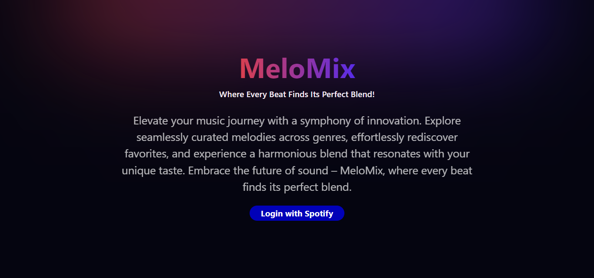
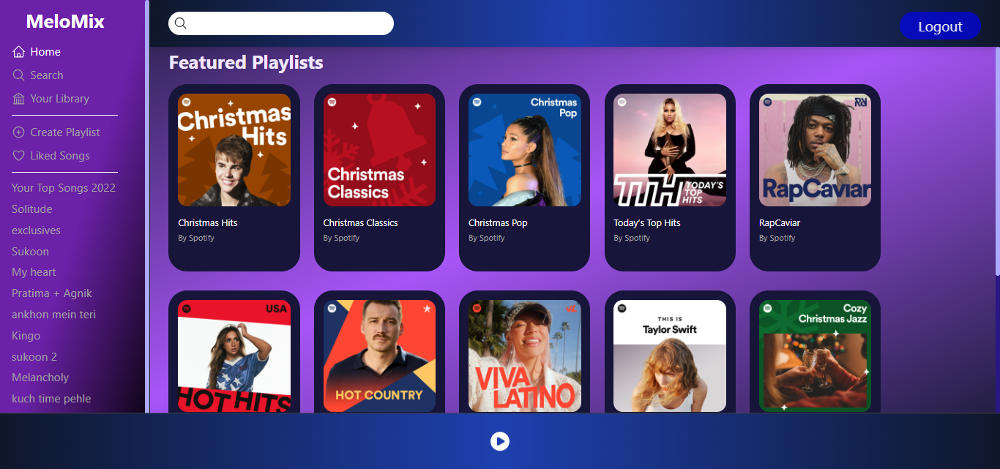

# MeloMix




MeloMix is a dynamic music platform created with NextJs, NextAuth, TailwindCSS, and the Spotify API. Elevate your music experience by seamlessly connecting MeloMix to your Spotify account, unlocking a personalized journey through your playlists, songs, and more. This project showcases a harmonious blend of cutting-edge technologies to provide users with an intuitive and immersive interface.

## Features

- **Spotify Integration:** Connect MeloMix to your Spotify account effortlessly, gaining access to all your playlists and favorite tracks.
- **Dynamic UI:** Experience a sleek and responsive user interface crafted with NextJs and enhanced by the versatility of TailwindCSS.
- **Authentication:** Utilize NextAuth for secure and seamless user authentication, ensuring a personalized and private music exploration.

## Getting Started

1. Clone the repository.

     ```
        git clone https://github.com/Agnik7/melomix.git
     ```

2. Create a `.env.local` file and set the following environment variables:

    ```
        SPOTIFY_CLIENT_ID = <Your Spotify Client ID>
        SPOTIFY_SECRET= <Your Spotify Client Secret>
        JWT_SECRET= <Your JWT Secret Key>
    ```

2. Install the dependencies.

     ```
        npm install
    ```

4. Run the application.

    ```
        npm run dev
    ```
## Technologies Used

- [NextJs](https://nextjs.org/) - React framework for building server-side rendered and static web applications.
- [NextAuth](https://next-auth.js.org/) - Authentication library for Next.js projects.
- [TailwindCSS](https://tailwindcss.com/) - A utility-first CSS framework for rapid UI development.
- [Spotify API](https://developer.spotify.com/documentation/web-api/) - Integrate Spotify features and data into your application.


## License

This project is licensed under the [MIT License](LICENSE).

---

_Enjoy the perfect blend of technology and music with MeloMix!_ 🎶✨
